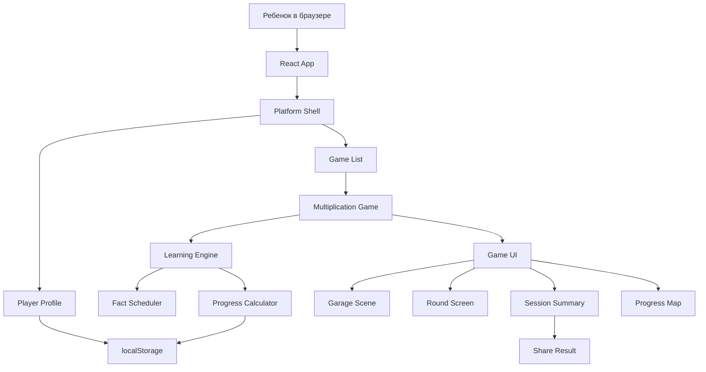

# План реализации MVP: платформа обучающих игр и "Адаптивный гараж"

Источник правды:

- `product-spec.md`
- `product-vision.md`

## 1. Цель этапа Plan

Этот документ переводит спецификацию в порядок разработки. Его задача - не повторить весь PRD, а зафиксировать:

- стек;
- архитектуру;
- модули;
- этапы реализации;
- зависимости между задачами;
- проверки качества;
- первый вертикальный срез, который можно быстро запустить и посмотреть.

## 2. Рекомендуемый стек

Для MVP выбираем:

- **Vite** - сборка статического frontend-приложения;
- **React** - экраны, состояние интерфейса, компоненты;
- **TypeScript** - типы для игрового прогресса и алгоритмов;
- **CSS** без тяжелого UI-фреймворка - проще сделать индивидуальный детский стиль;
- **localStorage** - хранение никнейма, прогресса и локального рейтинга;
- **Nginx** - раздача папки `dist` на сервере.

Почему так:

- можно быстро развернуть на своем сервере;
- не нужна база данных;
- проект остается достаточно простым;
- есть хороший путь к расширению: позже можно добавить backend, не переписывая весь frontend.

## 3. Архитектурная схема

Ключевой принцип: учебная логика не должна жить внутри визуальных компонентов. Scheduler, расчет прогресса и хранение данных делаем отдельно, чтобы их можно было тестировать.

## 4. Модули

### Platform Shell

Отвечает за:

- стартовый экран;
- ввод никнейма;
- список игр;
- настройки профиля;
- общий layout приложения;
- переход в игру.

### Storage Layer

Отвечает за:

- чтение `localStorage`;
- запись `localStorage`;
- миграцию данных, если структура поменяется;
- безопасный fallback, если данных нет или они сломаны.

### Multiplication Engine

Отвечает за:

- список фактов умножения;
- canonical key, например `6x7`;
- выбор следующего примера;
- обновление статистики после ответа;
- расчет статуса факта;
- очередь ошибок.

### Multiplication Game UI

Отвечает за:

- экран гаража;
- старт сессии;
- экран вопроса;
- ввод ответа;
- мгновенную обратную связь;
- итоги сессии;
- экран "Мой прогресс".

### Visual Layer

Отвечает за:

- объемный детский стиль;
- блочные формы;
- гараж/мастерскую;
- транспорт;
- анимации ответа;
- визуальный прогресс.

### Share and Local Leaderboard

Отвечает за:

- копирование ссылки;
- Web Share API, если доступен;
- текстовый результат;
- локальный рейтинг на устройстве.

## 5. Первый вертикальный срез

Первый срез должен доказать, что продуктовая петля работает от начала до конца, пусть даже с простой графикой.

Состав первого среза:

1. Открыть приложение.
2. Ввести никнейм.
3. Увидеть карточку игры.
4. Запустить игру.
5. Ответить на 10-15 примеров.
6. Получить feedback на правильные и неправильные ответы.
7. Увидеть итог сессии.
8. Перезагрузить страницу и увидеть, что прогресс сохранился.

В этот срез пока не обязательно включать:

- красивую финальную 3D-графику;
- полный лидерборд;
- все достижения;
- сложный алгоритм mastery.

Важно рано проверить именно учебный цикл и сохранение данных.

## 6. Этапы разработки

### Этап 0. Каркас проекта

Цель: получить запускаемое приложение.

Задачи:

- создать Vite + React + TypeScript проект;
- настроить команды `npm run dev`, `npm run build`, `npm run preview`;
- создать базовую структуру папок;
- добавить пустые экраны Platform и Multiplication Game;
- проверить mobile width 360 px.

Критерий готовности:

- проект запускается локально;
- проект собирается в `dist`;
- есть главный экран и переход в заглушку игры.

### Этап 1. Профиль и localStorage

Цель: сохранить никнейм и базовый профиль.

Задачи:

- создать типы `PlayerProfile`, `GameProgress`, `FactProgress`;
- реализовать `storage.ts`;
- добавить создание профиля при первом входе;
- добавить изменение никнейма;
- добавить сброс локального прогресса.

Критерий готовности:

- никнейм сохраняется после перезагрузки;
- некорректные данные в localStorage не ломают приложение;
- можно сбросить прогресс.

### Этап 2. Учебный engine

Цель: сделать ядро, которое выбирает примеры и обновляет прогресс.

Задачи:

- создать список фактов умножения;
- реализовать canonical key;
- реализовать выбор следующего факта;
- реализовать error queue;
- реализовать обновление статистики после ответа;
- реализовать расчет статуса `new`, `learning`, `review`, `mastered`;
- добавить unit-тесты на scheduler и progress.

Критерий готовности:

- ошибки возвращаются через 2-5 других примеров;
- слабые факты появляются чаще mastered-фактов;
- статистика обновляется предсказуемо;
- engine можно тестировать без UI.

### Этап 3. Игровой раунд

Цель: ребенок может пройти тренировку.

Задачи:

- создать экран старта сессии;
- создать карточку примера;
- сделать цифровой ввод;
- добавить проверку ответа;
- добавить мгновенный feedback;
- добавить таймер как скрытый или вторичный элемент;
- завершать сессию после заданного числа примеров или раундов;
- сохранять итог в профиль.

Критерий готовности:

- ребенок проходит полную сессию;
- правильные и неправильные ответы обрабатываются;
- итог сохраняется;
- интерфейс удобен на телефоне.

### Этап 4. Мой прогресс

Цель: показать понятный результат.

Задачи:

- сделать карту фактов;
- показать статусы фактов;
- показать сегодняшнее улучшение;
- показать трудные факты;
- показать достижения сессии;
- добавить переход из итогов в "Мой прогресс".

Критерий готовности:

- ребенок понимает, что улучшилось;
- видны трудные факты;
- экран работает на mobile без горизонтального скролла.

### Этап 5. Визуальный слой

Цель: превратить учебный экран в приятную детскую игру.

Задачи:

- оформить платформу в едином стиле;
- сделать гараж/мастерскую;
- добавить транспорт как объект прогресса;
- добавить объемные карточки, блоки, тени, простые анимации;
- добавить позитивную анимацию правильного ответа;
- добавить мягкую реакцию на ошибку;
- проверить, что визуал не мешает скорости вопросов.

Критерий готовности:

- продукт не выглядит как обычная форма;
- есть легкий Minecraft-vibe без копирования бренда;
- 2.5D/объемный стиль читается на телефоне;
- анимации не тормозят игру.

### Этап 6. Шаринг и локальный рейтинг

Цель: дать социальный слой без backend.

Задачи:

- добавить кнопку "Поделиться";
- использовать Web Share API, если доступен;
- добавить fallback копирования текста;
- добавить локальный рейтинг на устройстве;
- показывать рейтинг по прогрессу, а не только по скорости.

Критерий готовности:

- можно отправить ссылку другу;
- можно скопировать текст результата;
- локальный рейтинг не создает ощущения наказания.

### Этап 7. Подготовка к Nginx

Цель: убедиться, что проект можно разместить как статический сайт.

Задачи:

- проверить `npm run build`;
- проверить `npm run preview`;
- добавить краткую инструкцию деплоя;
- зафиксировать пример Nginx `try_files`;
- проверить, что маршруты работают после refresh.

Критерий готовности:

- папка `dist` готова к выкладке;
- приложение открывается после перезагрузки на любом маршруте;
- нет зависимости от Node.js на сервере.

## 7. Порядок задач

| Шаг | ID | Задача | Зависит от | Проверка |
|---:|---|---|---|---|
| 1 | P0-01 | Каркас проекта | нет | `npm run build` |
| 2 | P0-02 | Профиль и localStorage | P0-01 | перезагрузка сохраняет ник |
| 3 | P0-03 | Главный экран платформы | P0-02 | карточка игры видна |
| 4 | P0-04 | Engine фактов и scheduler | P0-01 | unit-тесты/ручная проверка |
| 5 | P0-05 | Игровой раунд | P0-02, P0-04 | полная сессия |
| 6 | P0-06 | Error queue | P0-04, P0-05 | ошибка возвращается позже |
| 7 | P0-07 | Итоги и Мой прогресс | P0-05 | карта фактов видна |
| 8 | P0-08 | Детский визуальный слой | P0-05 | mobile screenshot |
| 9 | P0-09 | Шаринг | P0-07 | ссылка/текст копируется |
| 10 | P0-10 | Локальный рейтинг | P0-07 | рейтинг обновляется |
| 11 | P0-11 | Подготовка к Nginx | P0-01 и все P0 | `npm run build` + preview |

## 8. Технические решения

### Хранение данных

Используем localStorage с версионированными ключами:

- `eduGame.profile.v1`
- `eduGame.localLeaderboard.v1`

В коде должен быть один слой доступа к localStorage. Компоненты не читают localStorage напрямую.

### Навигация

Для MVP можно использовать простое состояние экрана внутри React без `react-router`. Если уже на первом этапе хочется маршруты, допустим `react-router`, но это не обязательно.

Рекомендация: начать с простого `currentScreen`, чтобы не усложнять. Для Nginx так проще. Когда игр станет больше, можно перейти на маршруты.

### 3D и визуал

Рекомендация для MVP:

- не начинать со сложного Three.js;
- сделать 2.5D через CSS: изометрические блоки, тени, transform, layered cards;
- если CSS-уровня не хватит, добавить небольшую canvas/Three.js сцену только для гаража;
- не делать 3D основой игрового процесса.

Так мы быстрее получим красивый результат и не утонем в технической сложности.

### Алгоритм mastery

На MVP достаточно простого правила:

- `new`: попыток меньше 2;
- `learning`: точность ниже 80% или streak меньше 3;
- `review`: точность 80%+ и streak 3-4;
- `mastered`: точность 90%+ и streak 5+, среднее время ответа ниже выбранного порога.

Порог времени можно начать с 5 секунд и потом уточнить.

## 9. Проверка качества

### Каждый этап должен проверять

- сборку;
- mobile ширину 360 px;
- отсутствие горизонтального скролла;
- сохранение данных после reload, если этап затрагивает прогресс;
- соответствие `product-spec.md`.

### Перед приемкой MVP

Проверить сценарии:

- первый вход;
- никнейм;
- запуск игры;
- правильный ответ;
- ошибка;
- повтор ошибки;
- итог сессии;
- мой прогресс;
- поделиться;
- локальный рейтинг;
- reload страницы;
- build и preview.

## 10. Границы реализации

Можно делать сразу:

- Vite + React + TypeScript;
- localStorage;
- CSS 2.5D визуал;
- простую анимацию;
- локальный рейтинг;
- шаринг через Web Share API/fallback.

Нужно спросить перед:

- backend;
- база данных;
- настоящая авторизация;
- глобальный leaderboard;
- чат;
- сбор персональных данных;
- тяжелая 3D-библиотека, если она станет центральной зависимостью.

Нельзя делать:

- публичный рейтинг с реальными именами детей;
- наказание за ошибки;
- игровой слой, который сильно снижает плотность примеров;
- обязательный видимый таймер как базовый режим.

## 11. Definition of Done для MVP

MVP готов, если:

- приложение собирается в `dist`;
- его можно раздать через Nginx;
- ребенок может пройти тренировку на телефоне;
- прогресс сохраняется в браузере;
- scheduler учитывает слабые факты и ошибки;
- "Мой прогресс" показывает карту фактов;
- визуально игра выглядит объемной и детской;
- есть шаринг результата;
- ограничения localStorage и отсутствия общего leaderboard явно отражены в документации.

## 12. Следующий шаг

Следующий этап фреймворка - **Tasks / Implement Handoff**.

Первая задача разработчику уже описана в `product-spec.md`: `P0-01 Создать основу проекта`.

Рекомендуемое действие сейчас: запустить реализацию `P0-01`, затем провести review по критериям приемки и только после этого переходить к `P0-02`.
